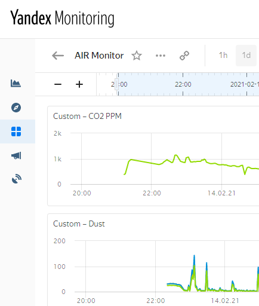

### IoT Dipstick Prototype

### Overview
IoT based on ESP8266 ([NodeMCU v3 board](http://www.nodemcu.com/index_cn.html)) and [Yandex Cloud](https://cloud.yandex.ru/) 
with integration with [Alice](https://yandex.ru/dev/dialogs/alice/doc/about.html)  assistant see [alice-func](terraform/cloud-functions/alice-func)

Alice configuration can't be provided in the source code, you have to configure it on your own. See references in the end of this page.

### Cloud infrastructure provisioning

note to start working with terraform you have to make a `terraform/variables_yc_account.tf`
file with actual values based on the [yandex terraform provider](https://registry.terraform.io/providers/yandex-cloud/yandex/latest/docs)

1. cd `./terraform`
1. make `variables_yc_account.tf` based on [variables_yc_account.tf.sample](terraform/variables_yc_account.tf)
1. `terraform init`
1. `terraform apply`

### Arduino firmware

the firmware is located in `arduino/air-monitor`, it is based on the [Platform IO](https://platformio.org/platformio-ide) as a replacement for Arduino IDE.

#### Initialization
1. create your yandex cloud by the terraform
1. add/modify your wi-fi settings in the `arduino/air-monitor/local_specific_variables.h` 
Once you have initialized your yandex cloud with the terraform scripts `arduino/air-monitor/local_specific_variables.h` 
#### Note
_Cloud infrastructure provisioning_ step generates `arduino/air-monitor/local_specific_variables.h` based on the   
file [arduino/air-monitor/local_specific_variables.h.sample](arduino/experements/air-monitor/local_specific_variables.h.sample)
and your environment settings, for more information see `arduino/scripts/create_local_specific_variables.sh`

### Resources to get started with the project
* [Before to Get Started](../../wiki/Before-to-Get-Started) - List of resources to get required knowledge to work with the project might be found in the wiki page
* [Prehistory and Architecture notes](../../wiki/Prehistory-and-Architecture-notes) - Prehistory of an approach might be found here
* [Alice abilities overview](https://yandex.ru/dev/dialogs/alice/doc/about.html) - Alice abilities development get startred
* [Alice based on the cloud function](https://yandex.ru/dev/dialogs/alice/doc/deploy-ycloud-function.html) - How to integrate [alice-func](terraform/cloud-functions/alice-func) into Alice ability
